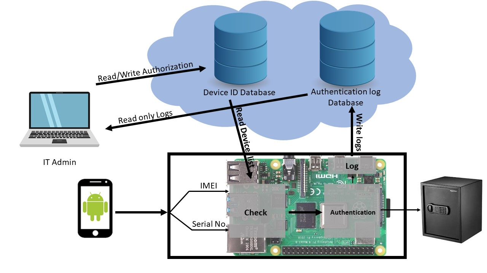

# Defensezoid
#### Here, Security never sleeps…
## Introduction
The first safe invented dates back to about the 13th century B.C., found in the tomb of Pharaoh Ramesses II, it was a wooden safe with a locking system like the ones that are currently used for pin tumbler locks. Since then, the technology of securing vaults and safes started to develop. From safes with pin tumbler locks to Roman locking systems to combination locks, the security technologies have improved a lot. However, the techniques of unauthorized access also increased. Hence, the need for alarm systems. The 18th century vaults having bells inside started the history of alarm systems which gradually evolved into the burglar alarms we have nowadays.
These days, in the 21st century, the types of locks mostly used are key locks, mechanical combination locks, electronic combination locks and biometric locks. Every lock has some vulnerability or another. For example, in case of key locks, the keys can be stolen or the lock can be mechanically picked. Same goes for the mechanical combination lock though the probability of someone guessing the combination is pretty slim.
Electronic combination locks require the authorized user to type in the pin or password on a touchscreen or on a keypad. Both of these put forth serious vulnerabilities.
The user typing in the pin or password are prone to be the victim of ‘Smudge Attacks’. Smudge attacks are a threat for three reasons. First, smudges are surprisingly persistent in time. Second, it is surprisingly difficult to incidentally obscure or delete smudges through wiping or pocketing the device. Third and finally, collecting and analyzing oily residue smudges can be done with readily-available equipment such as a camera and a computer. (Refer to the paper Smudge Attacks on Smartphone Touch Screens by University of Pennsylvania https://www.researchgate.net/publication/228644465_Smudge_Attacks_on_Smartphone_Touch_Screens )
The users typing in the pin or password on a keypad leave thermal residues and the attacker can figure out the entered pin/ password using Thermal Residue based post factum attacks. (Refer to the paper Thermanator: Thermal Residue-Based Post Factum Attacks on Keyboard Password Entry by University of California, Irvine https://arxiv.org/pdf/1806.10189.pdf )
Coming to biometric locks, the most common biometric lock is Fingerprint-based. It runs on the principle that every person has a unique fingerprint that cannot be duplicated. However, this also presents various vulnerabilities. For example, in 2014, a news went viral that a hacker could successfully fake the fingerprint of Germany’s defense minister from her high-resolution pictures. These days, unauthorized users could even 3D print authorized fingerprints or use pictures of the fingerprints. There are numerous attacks that can be done on biometric locks. (Refer to paper on Vulnerabilities of Fingerprint Authentication Systems and Their Securities by Jatiya Kabi Kazi Nazrul Islam University, Bangladesh, https://www.researchgate.net/publication/324173153_Vulnerabilities_of_Fingerprint_Authentication_Systems_and_Their_Securities )
## Proposal
To overcome the vulnerabilities and security issues of vaults and safes these days, we propose to build a lock which would use the user’s android device as the primary physical key.  
Your Android phone can now double as a security key.
The vault would be unlocked only when the authorized android device is physically connected via a data cable to the lock. Now you might be wondering that it would cause a problem similar to that of the physical key, that is that the android device could be stolen and used by unauthorized users.
No, in case of android devices, we could allow and revoke permissions to unlock the vault and it would obviously be protected by the strong android security. Moreover, if the vault is used in firms where there is more than one authorized user, the admin could add the smartphones of each of the user in the database of authorized users. What more? The vault would log each lock and unlock operation with the device id and a timestamp, accessible to the administrator. An unauthorized attempt to unlock can raise an alarm instantly.
## What data is used to uniquely identify a user?
The International Mobile Equipment Identity (IMEI) number and the Serial number of the device is used to uniquely identify a user. As we know, the IMEI number of a device cannot be changed, nor can be the Serial number. Both of them are hard coded into the device. Hence, an unauthorized user cannot reuse the IMEI and Serial number.
## Where is the data stored and is it safe?
The data is stored in Microsoft Azure Cosmos Database. The data is AES-256 encrypted in the servers and it makes sure that the data is not accessible to any unauthorized 3rd party. No local copy of the data is stored in the devices. This implies that the vault cannot be opened in case there is a loss of internet connectivity and the security is also not compromised with.
## How do we plan to achieve this?
We are solely relying on Android Debug Bridge or ADB to get the IMEI and serial number of the device from the phone. The admin will have to connect the phone of the authorized user to his computer and run our program. The program will extract the IMEI and Serial number from the device and store it in the cloud database. This is the authorization process. When the authorized user connects his phone to the vault, the micro controller in the vault checks the IMEI and Serial number of the device against the cloud database. If the device matches with one in the database, the user is authorized and the vault is unlocked. All operations on the lock are logged in another cloud database and easily accessible to the admin.
## Data Security
Even the admin is not authorized to edit the logs. Hence, no unauthorized person can get away with an unauthorized operation. It will be logged always.
## Platforms used
•	Microsoft Azure Cosmos DB
•	Java
•	Python
•	Android Debug Bridge
•	Raspberry pi or similar a micro controller

## Flowchart
 
## SWOT Analysis
 
## Conclusion
As we see that safes have various different type of vulnerabilities, we claim that our algorithm is much more secure than the vaults used these days. When implemented, this vault combines the concepts of physical keys with software authentication for high security.
